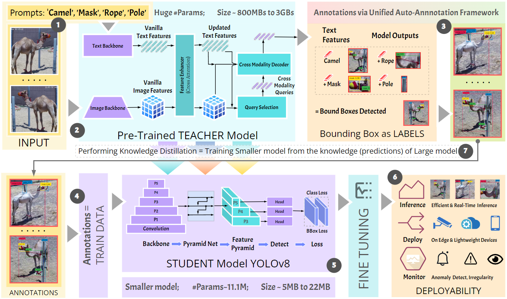

# Camel Farm Monitoring Framework

## Overview

This repository contains the code for an automated framework designed for camel farm monitoring. The framework introduces two key contributions:

1. **Unified Auto-Annotation Framework:**
   - Combines two models, GroundingDINO (GD), and Segment-Anything-Model (SAM), to automatically annotate raw datasets extracted from surveillance videos.

2. **Fine-Tune Distillation Framework:**
   - Conducts fine-tuning of student models using the auto-annotated dataset.
   - Involves transferring knowledge from a large teacher model to a student model, resembling a variant of Knowledge Distillation.
   - Aims to be adaptable to specific use cases, enabling the transfer of knowledge from large models to small models, making it suitable for domain-specific applications.

## Method Figure

## Key Features

- **Automated Annotation:** Utilizes GD and SAM models for automatic annotation of raw surveillance video datasets.
  
- **Fine-Tune Distillation:** Conducts fine-tuning of student models for efficient real-time object detection.
  
- **Adaptability:** Framework is designed to be adaptable to specific use cases, allowing knowledge transfer from large models to small models.

## Dataset and Pre-trained Model

- **Raw Dataset:** The framework leverages a raw dataset collected from Al-Marmoom Camel Farm in Dubai, UAE.

- **Pre-trained Model:** GroundingDINO is used as the pre-trained teacher model while YOLOv8 as the student model for the Fine-Tune Distillation framework.

## Deployable Model

The Fine-Tune Distillation framework produces a lightweight deployable model, YOLOv8, demonstrating high performance and computational efficiency for efficient real-time object detection.

## Usage

To use this framework, follow the instructions provided in the corresponding directories for the Unified Auto-Annotation and Fine-Tune Distillation frameworks.

## Citation

If you find this work useful for your research, please consider citing:

[Domain Adaptable Fine-Tune Distillation Framework For Advancing Farm Surveillance]
[Raza Imam, Muhammad Huzaifa, Nabil Mansour, Shaher Bano Mirza, Fouad Lamghar]
[Link will be out soon]
